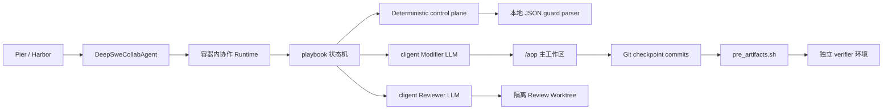

# DeepSWE 多 Agent 协作评测方案

## 1. 目标

在 DeepSWE 评测集上运行自定义的“修改 → 审查 → 修订”协作流程，比较单 Agent、自审和异构 Agent 协作的效果。协作 treatment 只包含 Modifier 和 Reviewer 两个 LLM Agent；状态流转和结构化输出判定由本地确定性控制逻辑完成，不引入 Captain/Judge 模型调用。

设计优先级如下：

1. 以方便、可靠地在 DeepSWE/Pier 上运行为第一目标。
2. 使用 Pier/Harbor 原生的任务隔离、工件提取和 verifier，不依赖 SWE-bench Pro runner。
3. 尽量使用本地 `sublang-ai/cligent` 和 `sublang-ai/playbook` 进行 dogfooding，并记录实际使用反馈。
4. 隐藏测试和 verifier 不进入协作循环，只评价最终提交。

本地依赖仓库：

- `cligent`：`/Users/kgm/Projects/merico/cligent`
- `playbook`：`/Users/kgm/Projects/merico/playbook`

## 2. 推荐架构



各组件职责：

- Pier/Harbor：准备任务环境、执行自定义 Agent、管理网络策略、提取 patch、运行 verifier 和汇总 reward。
- `DeepSweCollabAgent`：Pier 自定义 Agent 适配层，负责安装和启动容器内协作 Runtime，并回填 AgentContext。
- `playbook`：表达和执行有限状态机，控制修改、审查、修订、重试、轮数和最终交付；workflow 不定义直接 Captain 工作。
- `cligent`：统一驱动 Codex、Claude Code、OpenCode 等 coding-agent SDK/CLI，提供事件流、session、usage、permissions 和 abort。
- Deterministic control plane：将唯一的初始任务输入映射为固定 FSM 入口事件，并把 Reviewer 的严格 JSON 输出机械映射为 guard；它不调用模型、不消耗 token。
- Git：保存每轮可信修改。DeepSWE 的 `pre_artifacts.sh` 从最终 HEAD 提取相对 base commit 的 patch。

## 3. 为什么在任务容器内运行 cligent/playbook

`cligent` 的内置 adapter 驱动本地 SDK/CLI，并通过 `cwd` 访问代码工作区。Pier 的 `/app` 位于任务容器中，宿主机进程不能直接把本地 adapter 的 `cwd` 指向容器内部路径。

因此推荐：

1. Pier 自定义 Agent 是宿主侧的薄 Python 适配层。
2. `cligent`、`playbook`、Node runtime 和 coding-agent SDK/CLI 安装在任务容器中。
3. Python 适配层通过 Harbor `environment.exec()` 启动容器内 runtime。

不建议为了宿主侧运行 cligent 而实现一套跨 Python/TypeScript 的远程执行 adapter；这会显著增加复杂度，也不利于 DeepSWE 原生运行。

## 4. Pier 自定义 Agent

建议目录：

```text
agents/deep_swe_collab/
├── __init__.py
├── pier_agent.py
├── runtime/
│   ├── package.json
│   ├── package-lock.json
│   ├── src/
│   └── dist/
├── playbook/
│   ├── deep-swe-collab.md
│   └── deep-swe-collab.playbook/
├── prompts/
├── configs/
└── tests/
```

`pier_agent.py` 实现 Harbor `BaseAgent`：

- `setup(environment)`：
  - 上传 runtime、playbook artifact 和依赖包；
  - 安装 Node runtime 和所需 coding-agent SDK/CLI；
  - 记录实际安装版本。
- `run(instruction, environment, context)`：
  - 将 DeepSWE instruction 安全写入容器；
  - 在 `/app` 上运行协作 workflow；
  - 收集 summary、token usage、耗时和 outcome；
  - 将最终数据写入 `/logs/agent/`；
  - 回填 `AgentContext`。

Pier 当前支持通过 import path 加载自定义 Agent。预期调用形式：

```bash
pier run \
  -p tasks/fastapi-implicit-head-options \
  --agent agents.deep_swe_collab.pier_agent:DeepSweCollabAgent \
  --ak modifier_adapter=codex \
  --ak reviewer_adapter=claude \
  --ak max_reviews=2
```

正式实验推荐使用 Pier job config 固化完整配置，而不是依赖较长的命令行。

## 5. 专用 DeepSWE playbook

不直接使用 `@sublang/playbook` 自带的 CODE playbook。现有 CODE workflow 面向 spex/spec 驱动仓库，包含以下 DeepSWE 不需要或可能产生干扰的行为：

- 判断任务能否在一个 commit 完成，否则创建 IR；
- 更新 `specs/` 和 spec map；
- Coder、Reviewer、Committer 三种语义角色；
- 针对 spex 新旧目录结构的审查规则。

应新建一个只表达 DeepSWE 协作实验语义的 playbook。

该 playbook 通过嵌入式六端口 runtime 运行，而不是直接调用 `playbook run` CLI。嵌入式 host 可以精确绑定两个 `Cligent` player、提供 deterministic `callJudge`，并对未使用的 `callCaptain` 设置 fail-fast stub。这样既复用 playbook 的状态机和 trace，又不会因为通用 CLI 的 Captain 绑定引入第三个 LLM。

该 workflow 是非交互式的：Pier/harness 以 Boss 身份只提交一次任务输入，内容就是当前 task 的 `instruction.md`。runtime 将这次输入映射为 `START` 后，后续 Modifier prompt、Reviewer prompt 和修订反馈都由 FSM 根据既有 instruction、patch 和 findings 自动生成，不再请求新的 Boss 输入。workflow 不得包含 `awaitBossReply` 或其他等待人工回复的状态；遇到信息不足时，Agent 应基于仓库和 instruction 作合理假设，无法继续则返回结构化失败。

首版建议显式展开两轮 review，而不是一开始就实现动态循环：

```text
prepare
  → initial_modify
  → checkpoint_0
  → review_1
      ├── approve → deliver
      └── revise → revision_1
                       → checkpoint_1
                       → review_2
                           ├── approve → deliver
                           └── revise → final_revision
                                            → checkpoint_2
                                            → max_reviews_reached
```

显式状态有以下优点：

- 状态和 artifacts 容易检查；
- 每个阶段可独立设置 timeout；
- 异常和降级语义明确；
- 便于可视化和测试；
- 避免首版受动态计数器或复杂 guard 能力限制。

后续验证稳定后，再把它泛化为可配置的 `max_reviews=N` 循环。

## 6. cligent Agent 配置

创建两个主要 `Cligent` 对象：

### 6.1 Modifier

- 工作目录：`/app`。
- 允许修改文件和运行公开测试。
- 初始修改和所有修订复用同一个 session。
- 初始 prompt 只接收公开 instruction、代码仓库和普通工程指令。
- 修订 prompt 额外接收结构化 findings 和历史处理情况。

### 6.2 Reviewer

- 工作目录：每轮独立的 detached Git worktree。
- 每轮使用 fresh session，降低对上一轮结论的锚定。
- 可以读取完整代码、当前 patch、原始 instruction，并运行公开测试。
- 只输出 findings，不对 `/app` 贡献代码。
- 即使 Reviewer 修改或 commit，它也只影响临时 worktree。

Reviewer 隔离不能只依赖 adapter permissions。不同 adapter 对“允许执行 shell，但禁止写文件”的表达能力并不完全一致，尤其 Bash 命令本身可能写入文件。独立 worktree 是跨 adapter 更可靠的事务边界。

### 6.3 非 LLM 控制端口

playbook host 还需实现以下控制端口，但不为它们创建 `Cligent`：

- `callCaptain`：workflow 不包含 `captain` actor，端口实现为 fail-fast stub；一旦意外调用即判配置或编译错误。
- `classifyBossText`：把 Pier/harness 代表 Boss 提交的唯一 DeepSWE instruction 确定性映射为固定的 `START` 事件，不做自然语言意图分类。
- `callJudge`：解析自定义 `buildJudgePrompt` 产生的 JSON envelope，并返回 `{guard, ...payload}`；整个过程是本地纯函数。

因此实际模型调用严格限定为 Modifier 和 Reviewer。playbook trace 中暂时仍可能出现 `judge.call.started/finished`，但这些记录表示本地 guard 判定，不对应 LLM 请求、token 或费用。

## 7. Git 与 DeepSWE patch 提取

DeepSWE v1.1 的 `pre_artifacts.sh` 从 base commit 到最终 HEAD 提取已提交修改。因此所有可信 Modifier 状态都应机械 checkpoint：

1. Modifier 完成一轮修改。
2. Harness 检查当前状态和 patch 是否有效。
3. Harness 执行 `git add -A`。
4. Harness 创建固定格式 checkpoint commit。
5. Reviewer 从该 commit 创建 detached worktree。
6. 修订成功后创建新的 checkpoint commit。

建议 commit message：

```text
collab: initial implementation
collab: revision 1
collab: final revision
```

DeepSWE verifier 只消费最终 diff，不要求中间 commit 历史整洁。机械 commit 可以避免引入第三个 Committer LLM，也保证最终未提交修改不会被 `pre_artifacts.sh` 丢失。

创建 review workspace 的概念流程：

```text
/app HEAD at checkpoint-N
  └── git worktree add --detach /tmp/deepswe-review-N HEAD
          └── Reviewer 在这里审查和运行公开测试
```

review 结束后删除临时 worktree；无论 Reviewer 做了什么，都不能污染 `/app`。

## 8. Reviewer 输出协议

Reviewer 输出严格 JSON。

通过示例：

```json
{
  "verdict": "approve",
  "summary": "Implementation covers the requested behavior.",
  "findings": []
}
```

要求修订示例：

```json
{
  "verdict": "revise",
  "summary": "Two blocking correctness issues remain.",
  "findings": [
    {
      "id": "R2-F1",
      "severity": "major",
      "file": "src/foo.ts",
      "line": 84,
      "issue": "Repeated registration loses the previous handler.",
      "evidence": "register() overwrites the map entry unconditionally.",
      "required_change": "Preserve and compose existing handlers."
    }
  ]
}
```

协议规则：

- `critical`、`major` 为 blocking findings。
- `minor`、`suggestion` 仅记录，不阻止交付。
- 非法 JSON 重试 Reviewer 一次，并明确要求修正格式。
- Reviewer 进程或 API 失败属于基础设施错误，优先交给 Pier job retry，不伪装成正常评分结果。
- 第 `N` 次 review 仍有 blocking findings 时，Modifier 获得一次最终修订机会，但不执行第 `N+1` 次 review。
- 此时正常交付最终 patch，但 outcome 标记为 `max_reviews_reached`，不能标记为 approved。

Modifier 应逐条记录：

- accepted：接受并修改；
- rebutted：有证据地反驳；
- unresolved：未完成或不确定。

## 9. playbook Captain/Judge 边界

playbook 术语在参考 workflow 的自然语言和 runtime 中容易混淆，本方案按以下含义使用：

| 概念 | 在通用 playbook 中 | 在本方案中 |
|---|---|---|
| Boss | 发起请求并可能继续回复的人或外部系统 | Pier/harness；只提交一次 `instruction.md` |
| Boss input | Boss 发给 workflow 的输入 | task 的 `instruction.md`，即唯一初始指令 |
| Captain | workflow 的协调视角；只有编译出 `src: 'captain'` 时才是实际 Agent actor | 不实例化，也不调用 |
| Player | 执行具体工作的 Agent | Modifier 和 Reviewer |
| Judge | 把 player 输出判定为 FSM guard/payload 的端口 | 本地确定性 JSON parser，不是 LLM |

因此，`instruction.md` 相当于“用户给系统的唯一任务输入”，但它不是 Captain。更准确的对应关系是：Pier/harness 代表 Boss，`instruction.md` 是 Boss input；playbook runtime 负责确定性编排，Modifier 和 Reviewer 执行工作。

参考 CODE workflow 中诸如 “Captain shall relay to Coder” 的表述，不等于必须先调用一个 Captain LLM 再调用 Coder。这里的 Captain 可以只是流程描述中的协调主体；如果编译结果直接进入 player actor，runtime 只调用相应 Player。只有 FSM 中实际存在 `src: 'captain'` 状态时才会调用 `callCaptain`。

本方案的完整输入与执行序列是：

```text
Pier/harness (Boss) -- instruction.md, exactly once --> playbook runtime
playbook runtime -- initial prompt --> Modifier
playbook runtime -- patch + instruction --> Reviewer
playbook runtime -- findings --> Modifier
...直到 approved、max_reviews_reached 或结构化失败
```

初次调用 `handleBossInput()` 并产生 `START` 后，workflow 在终态前不再等待 Boss。后续所谓“指令”都是 runtime 依据初始 instruction 和中间 artifacts 构造的内部 Agent prompt，不是新的用户输入。任何 `awaitBossReply` 都属于此评测方案的建模错误，应在 artifact 校验或 smoke test 中直接拒绝。

Captain 和 Judge 的 runtime 行为也不同：

- Captain 是一种 agent actor。只有 FSM 中存在 `src: 'captain'` 状态时才会调用 `callCaptain`。
- Judge 是 player 输出到 FSM guard 之间的 adjudication port。当前共享 player bridge 会在每次 `callPlayer` 完成后调用 `callJudge`。

本方案不定义任何 Captain 状态，因此不会产生 Captain Agent 调用。`callCaptain` 只保留为公共 runtime contract 要求的 fail-fast stub。

当前 playbook 包还不能仅通过重新编写自然语言 workflow 完全跳过 `callJudge` port，但 port 不必由 LLM 实现。首版使用 deterministic Judge：

1. 自定义 artifact 的 `buildJudgePrompt` 把 `stateId`、合法 guards 和 player `finalText` 编码为确定性 JSON envelope。
2. 嵌入式 host 的 `callJudge` 解析 envelope。
3. Modifier 状态机械选择唯一的成功 guard。
4. Reviewer 状态解析严格 JSON 中的 `verdict`，将 `approve` 映射为 `approved`，将 `revise` 映射为 `needsRevision`。
5. Findings 原文通过 verbatim payload 或 JSON 字符串进入 FSM context，不让另一个模型重述。

这使实际协作系统保持严格的两个 LLM Agent。Judge trace 应标记 `implementation: deterministic`，其 token 和 cost 为“不适用”，而不是伪造为 0 token 的模型调用。

如果希望连 `callJudge` port 和相应 trace 都消失，并让结构化 `PlayerResult` 直接成为 XState actor output，则需要修改 playbook 包的正式 runtime/compiler contract。可能的上游能力包括 `playerOutput.mode: 'structured-json'` 或可配置的 deterministic adjudicator，并需要同步修改 runtime 类型、player bridge、linker/compiler spec 和测试。这是有价值的 dogfooding 改进，但不是首版评测的前置条件。

## 10. Timeout 与成本控制

DeepSWE 单任务默认 Agent timeout 为 5400 秒。多轮协作很容易耗尽这一预算。

首版建议：

- `max_reviews=2`；
- 整体 deadline 由 runtime 统一管理；
- Modifier 初始实现获得最大预算；
- Reviewer 使用较短预算；
- 修订轮使用剩余预算动态分配；
- 每次 cligent 调用使用 AbortController；
- 不在 timeout 前启动没有足够完成时间的新 review/revision。

一种初始分配参考：

```text
initial modifier   35–45 min
review 1            8–10 min
revision 1         12–15 min
review 2            8–10 min
final revision     使用剩余预算
```

实际分配应在 smoke run 后根据不同语言和仓库大小调整。

## 11. 依赖安装与可复现性

为确保 dogfood 的是本地 checkout，而不是 npm registry 上的发布版本：

1. 在宿主机对 `cligent` 和 `playbook` checkout 执行 `npm pack`。
2. 将 tarball 和锁文件放入 Agent bundle。
3. 在任务容器中同时安装两个本地 tarball。
4. 固定 Codex SDK、Claude Agent SDK、XState 等依赖版本。
5. 每个 trial 记录实际 package version 和 Git SHA。

初期可以在 Agent setup 阶段在线安装依赖。正式批量运行前，建议制作 Linux x64 的预安装依赖包，减少 113 个 trial 重复下载 Node 和 SDK/CLI 所带来的延迟及失败率。

DeepSWE task 的 Agent phase 通常为 `no-network`。模型调用需要使用 Pier 的 `--allow-agent-host` 或 job config，为对应 API/Auth 域名建立最小 allowlist。API key 通过 Pier Agent env 注入，不写入 prompt、日志和 artifacts。

## 12. Artifacts 与观测性

建议 `/logs/agent/` 结构：

```text
collab/
├── summary.json
├── playbook-trace.jsonl
├── cligent-events.jsonl
├── rounds/
│   ├── 00-modify/
│   │   ├── prompt.md
│   │   ├── events.jsonl
│   │   ├── patch.diff
│   │   └── metadata.json
│   ├── 01-review/
│   │   ├── prompt.md
│   │   ├── events.jsonl
│   │   └── review.json
│   └── 02-revise/
└── final/
    ├── patch.diff
    └── git-status.txt
```

`summary.json` 至少记录：

- Modifier、Reviewer 的 adapter、model、effort；
- 控制端实现版本，以及 `classifyBossText`、`callJudge` 均为 deterministic 的声明；
- cligent、playbook、coding-agent SDK 版本；
- 本地 cligent/playbook checkout SHA；
- review count 和 workflow outcome；
- Modifier、Reviewer 各自的 input/output tokens、tool uses、duration 和 cost；
- 本地 guard 判定次数和 duration，不将其计入模型 token/cost；
- findings 数量及严重级别；
- findings 的 accepted/rebutted/unresolved 状态；
- checkpoint commit hashes；
- final patch hash；
- setup、agent、verifier 错误分类。

首版可以直接保存 cligent event stream；后续建议实现 cligent events 到 Harbor ATIF trajectory 的转换，使 Pier viewer、analyze 和 critique 能直接处理协作轨迹。

## 13. Outcome 与失败语义

建议 outcome：

```text
approved
max_reviews_reached
modifier_failed
reviewer_failed
invalid_review_output
timeout
empty_patch
checkpoint_failed
```

其中：

- `approved` 和 `max_reviews_reached` 可以正常送入 verifier。
- 初始 Modifier 没有产生可信 patch 时，trial 应失败。
- Reviewer API/进程异常和非法输出重试失败应标记为基础设施/Agent 错误，并允许 Pier job retry。
- 不建议默认把 Reviewer 故障降级为正常交付，因为这会污染协作效果统计。
- 如确实需要高完成率，可以增加显式 `degraded_delivery` 模式，但必须单独统计，不能与 approved 混合。

## 14. 实验设计

建议至少比较：

| 组别 | Modifier | Reviewer | 目标 |
|---|---|---|---|
| Single | A | 无 | 单 Agent 基准 |
| Self-review | A | A | 测量协作流程本身 |
| Cross-review | A | B | 测量异构审查价值 |

如果要声称“协作机制本身带来提升”，Single 必须尽量保持：

- 相同 Modifier model/effort；
- 相同初始 prompt；
- 相同 task；
- 相同 timeout；
- 相同重复次数。

同时报告两种口径：

1. 实际系统效果：允许协作使用额外 token、时间和费用。
2. Matched budget：给 Single 相同的总 token 或 wall-clock 预算，减少“只是多投入算力”的混淆。

主要指标：

- binary reward；
- verifier 分项 pass fraction；
- 同任务 paired delta；
- token、费用和 wall-clock；
- review 轮数；
- Reviewer blocking finding 数量；
- finding 修复率；
- approved 与 max_reviews_reached 分层通过率；
- setup、Agent、verifier 基础设施错误率；
- patch churn 和每轮新增/删除行数。

## 15. 任务抽样与推进顺序

仓库已有稳定性和区分度筛选结果：

```text
00_all：113 题
└── 01_stable：99 题
    └── 02_broad_discriminative：51 题
        └── 03_core_discriminative：30 题
            ├── 05_sample_dev：12 题
            └── 05_sample_confirm：12 题
```

推荐实验阶段：

1. 现有 3 题 smoke：验证 harness、网络、认证、提交和 verifier。
2. `05_sample_dev` 12 题：调整 prompt、轮数、timeout 和失败语义。
3. 冻结配置。
4. `05_sample_confirm` 12 题：确认效果，避免继续针对 dev 调参。
5. `03_core_discriminative` 30 题：获得更稳定的 paired comparison。
6. 最后再考虑完整 113 题。

每种 Agent system 每题建议至少运行 4 次，并将基础设施错误从模型失败中单独统计。

## 16. 实施顺序

### Phase 1：Pier 边界验证

- 实现最小 `BaseAgent`。
- 在 `/app` 创建一次机械 commit。
- 验证 `pre_artifacts.sh` 能提取 patch。
- 验证 separate verifier 能正常评分。

### Phase 2：单 cligent Modifier

- 在容器安装本地 cligent。
- 跑单个 Modifier。
- 验证 API 认证、network allowlist、permissions、event stream、usage 和 timeout。
- 建立 Single baseline 所需产物。

### Phase 3：单轮审查

- 增加 Reviewer 独立 worktree。
- 实现严格 JSON review 和一次格式重试。
- 实现 revision 和 checkpoint。
- 验证 Reviewer 修改不会污染 `/app`。

### Phase 4：playbook 状态机

- 编写 DeepSWE 专用自然语言 playbook。
- 编译 GEARS/FSM/runtime artifact。
- 通过嵌入式六端口 host 将 player call 绑定到 cligent。
- 保存 playbook trace。

### Phase 5：完整两轮 workflow

- 增加第二次 review 和最终 revision。
- 实现 deadline、异常语义、summary 和完整 artifacts。
- 增加状态机、fake adapter 和工作区隔离测试。

### Phase 6：实验

- 3 题 smoke。
- 12 题 dev。
- 整理 cligent/playbook dogfooding 反馈。
- 冻结配置后运行 confirm/core。

## 17. 预期 dogfooding 反馈点

### cligent

- 容器环境和 headless 权限配置是否足够稳定。
- 不同 adapter 的只读/可执行权限是否具有可比较语义。
- session resume 在多轮长任务中的可靠性。
- event stream 是否足够生成统一协作轨迹。
- usage/cost 是否能跨 adapter 一致汇总。
- SDK/CLI 安装和版本探测是否适合短生命周期 benchmark 容器。

### playbook

- 专用 benchmark workflow 的编译体验。
- 有限次数循环、deadline 和异常路径的表达能力。
- 现有 `buildJudgePrompt` + deterministic `callJudge` 方案是否足够稳定和自然。
- 是否应新增 structured-output player mode，让合法结构化结果直接驱动 guard 并省略 `callJudge` port。
- headless embedding 下 trace 和 artifact 是否足够完整。
- Player role alias、fresh/resume session 选择是否易于控制。
- 是否方便向 Pier/ATIF 等外部观测系统输出结构化轨迹。

## 18. 结论

推荐把整个协作系统实现为 Pier 的一个自定义复合 Agent：Pier 是 benchmark harness，playbook 是协作控制面，cligent 只执行 Modifier 和 Reviewer 两个 LLM Agent，本地 deterministic parser 负责入口事件与 guard 判定，Git checkpoint 是协作系统与 DeepSWE verifier 之间唯一的提交接口。

这样既符合 DeepSWE/Harbor 的原生运行方式，也能真正覆盖 cligent 和 playbook 在隔离环境、长任务、多轮协作、恢复、事件和可观测性方面的实际使用体验。
