# DeepSWE 统一 Agent 评测基线：正式设计与实施计划

状态：核心实现完成，等待真实模型 smoke 与基线冻结

确认日期：2026-08-03

实现日期：2026-08-03

适用环境：本地 Docker + Pier 0.3.x

## 1. 背景与结论

当前 DeepSWE 仓库中，Codex、OpenCode、Kimi Code 和
`deep_swe_collab` 分别通过不同脚本、Pier Agent 和安装路径运行。OpenCode 与
mini-swe-agent 已有 shared runtime，Codex、Kimi Code 和现有协作 Agent 则仍可能
为不同任务镜像重复构建派生安装层。单 Agent 与多 Agent 的调用、认证、日志和
artifact 契约也不一致。

本设计建立一套新的评测基线：所有 coding agent 都由同一个容器内 runtime、同一套
cligent adapter 接口和同一个 Pier 自定义 Agent 驱动；single 与 collab 只在 workflow
层不同。新基线不承诺与现有专用脚本的历史结果保持数值连续。

结论：方案可行。主要工程工作不在 review loop 本身，而在以下四个边界：

1. 把 cligent、orchestrator、SDK/CLI 和 Node 固化为可复用的只读 runtime。
2. 将 Agent 名称解析为可复现的版本化 profile。
3. 为 single/collab 建立统一的认证、权限、timeout、事件和 artifact 契约。
4. 保持 direct review-loop 稳定，同时给未来 playbook backend 留出窄而明确的替换点。

## 2. 目标

### 2.1 功能目标

- 提供一个统一 Python CLI，支持单任务、任务列表、并发和重复运行。
- 使用 `--agent <profile>` 运行 single。
- 使用 `--agent collab --modifier <profile> --reviewer <profile>` 运行固定的
  review-loop。
- 由 Pier 继续负责任务隔离、trial 生命周期、artifact 下载、verifier 和 job 汇总。
- 通过一个通用 shared runtime 支持 Codex、Claude Code、Kimi Code、OpenCode 和
  Gemini。
- single 与 collab 共享 cligent、profile、认证、Git、日志、usage 和 artifact 代码。
- 输出统一的 resolved config、summary、事件流和 ATIF trajectory。

### 2.2 实验目标

- 将统一管线定义为新基线，不与旧 Agent 专用管线混算。
- single 与 collab 使用相同的 trial 总 wall-clock 上限。
- 完整记录实际模型、Agent/runtime 版本、token、费用、耗时和 workflow outcome。
- 将 workflow outcome 与 verifier reward 分开，避免把基础设施或审查降级误判为模型结果。

### 2.3 非目标

- 不替换或重新实现 Pier。
- 不支持 Modal；首版只支持本地 Docker。
- 不将 mini-swe-agent 接入新基线。
- 不实现任意多角色或任意 workflow DAG。
- 不在首版实现 playbook backend，只保留扩展接口。
- 不保证 OAuth 登录态并发克隆的安全性或稳定性；首版记录该风险但不阻塞运行。
- 不修改现有 Agent 专用脚本和 runtime；它们保留为历史参考。

## 3. 已确认的设计决策

| 主题 | 决策 |
|---|---|
| 基线 | 统一管线是新基线，不要求与旧结果等价 |
| runtime | 一个包含全部 Agent 依赖的通用只读镜像 |
| Agent 名称 | 引用版本化 profile，而不是 CLI 动态默认值 |
| topology | 只支持 `single` 与 `collab` |
| collab workflow | `collab` 固定表示 `review-loop` |
| workflow engine | 首版为 `direct`；保留未来 `playbook` 实现点 |
| single | 使用独立 `SingleWorkflow`，不编码为 `max_reviews=0` |
| harness | 统一 Python CLI 负责配置；Pier 是唯一执行引擎 |
| runtime 准备 | 支持独立 prepare 命令；eval 缺失时也可自动构建 |
| 环境 | Docker-only |
| 认证 | 优先复用 CLI 登录态；只复制认证数据，不继承个人行为配置 |
| Kimi | 使用 cligent 正式 Kimi ACP adapter，不实现私有 prompt adapter |
| 网络 | trial 仅开放模型和认证端点 |
| 时间预算 | single/collab 共用相同总 wall-clock 上限 |
| artifacts | 使用统一 schema，并生成 ATIF trajectory |
| 降级 | 已有可信 checkpoint 后，review/revision 故障可降级交付 |
| 首版验证 | 实测 Codex、Claude、Kimi、OpenCode；Gemini 暂标 unverified |
| 旧实现 | 保持不变，作为历史参考，不承担迁移兼容 |

### 3.1 实现状态

Phase 0–6 已按本设计完成，Phase 7 的无模型自动化和 Docker mount/probe 已完成。
真实模型 smoke 尚未自动启动，因为它会消耗登录态额度或产生 API 费用，应由实验负责人
显式选择 task、并发和 job name 后执行。

| 范围 | 状态 | 实现位置 |
|---|---|---|
| ExecutionPlan、profile、统一 CLI | 已完成 | `wip/agent_eval/` |
| content-addressed runtime 与 prepare | 已完成 | `wip/docker/agent-runtime/`、`wip/config/runtime-manifest.json` |
| Docker 只读 image mount | 已完成 | `wip/environments/agent_runtime.py` |
| 通用 Pier Agent 与最小凭据注入 | 已完成 | `wip/agents/deep_swe_agent/pier_agent.py` |
| 独立 SingleWorkflow | 已完成 | `runtime/src/single-engine.ts` |
| direct ReviewLoopWorkflow | 已完成 | `runtime/src/direct-engine.ts` |
| cligent events → ATIF | 已完成 | `wip/agents/deep_swe_agent/atif.py` |
| Codex/Claude/Kimi/OpenCode live smoke | 待显式运行 | 不在本次无费用验收中自动执行 |
| Gemini live smoke | 未验证 | profile 保持 `unverified` |

## 4. 概念模型

外部 CLI 的便捷语法不能直接成为内部领域模型。内部应先规范化为
`ExecutionPlan`：

```text
ExecutionPlan
├── topology: single | collab
├── workflow: single | review-loop
├── engine: direct
├── roles
│   ├── modifier: ResolvedAgentProfile
│   └── reviewer?: ResolvedAgentProfile
├── budget: ResolvedBudget
├── runtime: ResolvedRuntime
└── benchmark: ResolvedBenchmarkPolicy
```

规则：

- `--agent codex` 规范化为 `single/single/direct`，只有 modifier。
- `--agent collab --modifier kimi --reviewer codex` 规范化为
  `collab/review-loop/direct`。
- `collab` 不是 adapter，也不是 profile。
- 未来若增加其他 workflow，使用新的名称或代号，不改变 `collab` 的语义。
- 未来 playbook 只替换 engine，不改变 workflow、roles 和输出契约。

## 5. 总体架构

```mermaid
flowchart LR
    CLI["统一 Python CLI"] --> M["解析 profiles / 生成 run manifest"]
    M --> P["Pier"]
    P --> E["SharedRuntimeDockerEnvironment"]
    E --> T["DeepSWE task container"]
    R["只读 universal runtime"] -->|mount| T
    T --> A["DeepSweAgent"]
    A --> O["容器内 orchestrator"]
    O --> S["SingleWorkflow"]
    O --> C["ReviewLoopWorkflow"]
    S --> G["CligentRunner"]
    C --> G
    G --> AD["cligent official adapters"]
    AD --> W["/app 与 review workspace"]
    W --> CK["Git checkpoints"]
    CK --> PA["pre_artifacts.sh"]
    PA --> V["独立 verifier environment"]
```



职责边界：

- Python CLI：用户接口、profile 解析、runtime 准备、配置冻结和 Pier 命令生成。
- Pier：benchmark harness 和唯一 trial 执行引擎。
- Docker environment：运行原始任务镜像，并将 shared runtime 只读挂载进去。
- `DeepSweAgent`：Pier 生命周期适配、认证注入、网络 allowlist、启动 runtime、回填
  `AgentContext`。
- orchestrator：执行 workflow、deadline、重试、Git checkpoint 和结构化输出。
- cligent：执行 vendor adapter，统一事件、session、usage、permissions 和 abort。
- verifier：只消费最终 patch，不进入 Agent 协作循环。

## 6. 实际目录结构

新实现与旧实现并行，避免在开发阶段引入兼容分支：

```text
wip/
├── agent_eval/
│   ├── __init__.py
│   ├── cli.py                    # 统一 CLI
│   ├── profiles.py               # profile schema、解析与校验
│   ├── planning.py               # CLI → ExecutionPlan
│   ├── runtime_image.py          # manifest hash、inspect、build
│   ├── pier_command.py           # ExecutionPlan → pier run
│   └── test_*.py
├── config/
│   ├── agent-profiles.json       # 非秘密、版本化 profiles
│   └── runtime-manifest.json     # runtime 组件版本
├── docker/
│   └── agent-runtime/
│       └── Dockerfile
├── environments/
│   ├── agent_runtime.py
│   └── test_agent_runtime.py
├── agents/
│   └── deep_swe_agent/
│       ├── __init__.py
│       ├── pier_agent.py
│       ├── atif.py               # cligent events → ATIF-v1.7
│       ├── test_*.py
│       └── runtime/
│           ├── package.json
│           ├── package-lock.json
│           ├── tsconfig.json
│           └── src/
│               ├── main.ts
│               ├── collaboration-engine.ts
│               ├── single-engine.ts
│               ├── direct-engine.ts
│               ├── agent-runner.ts
│               ├── git-workspace.ts
│               └── *.test.ts
└── scripts/
    └── run_agent_eval.py         # 很薄的可执行入口，可调用 agent_eval.cli
```

`wip/agents/deep_swe_collab/`、现有 `run_*_eval.sh`、mini-swe/OpenCode shared
runtime 和 Kimi adapter 暂时不改。

## 7. CLI 设计

以下命令均从仓库的 `wip` 目录执行：

```bash
cd wip
uv sync
```

### 7.1 Runtime 准备

```bash
uv run python scripts/run_agent_eval.py runtime prepare
```

可选参数：

```text
--runtime-platform linux/amd64
--runtime-image <explicit-image>
--rebuild
--dry-run
```

行为：

1. 读取 runtime manifest、lockfile、Dockerfile 和 orchestrator 输入。
2. 计算内容指纹。
3. 默认解析为 `deep-swe/agent-runtime:<manifest-hash>`。
4. 检查本地镜像 labels、平台和组件版本。
5. 镜像缺失或显式 `--rebuild` 时构建。
6. 运行不需要模型凭据的版本探针。

### 7.2 Single

```bash
uv run python scripts/run_agent_eval.py eval \
  --task fastapi-implicit-head-options \
  --agent codex
```

### 7.3 Collab

```bash
uv run python scripts/run_agent_eval.py eval \
  --task-list data/selection/05_sample_dev.txt \
  --agent collab \
  --modifier kimi \
  --reviewer codex \
  --max-reviews 3
```

### 7.4 共同参数

首版至少支持：

```text
--task NAME                    可重复
--task-list PATH               txt，每行一个 task name，支持空行和 # 注释
--tasks-dir PATH
--agent PROFILE|collab
--modifier PROFILE
--reviewer PROFILE
--max-reviews N
--n-attempts N
--n-concurrent N
--jobs-dir PATH
--job-name NAME
--agent-timeout-multiplier X
--runtime-image IMAGE
--rebuild-runtime
--dry-run
```

角色的 model/effort 如需临时覆盖，可提供 `--model`、`--modifier-model`、
`--reviewer-model` 等参数。覆盖后生成一个新的 resolved profile/config digest，并完整
写入 metadata；不能静默改变原 profile。

校验规则：

- single 禁止 `--modifier`、`--reviewer` 和 `--max-reviews`。
- collab 必须同时提供 modifier 和 reviewer。
- profile 必须存在且状态允许执行；`unverified` profile 需要显式 opt-in，或在 Gemini
  验证完成前直接拒绝。
- 至少选择一个 task；task name 去重且必须存在。
- 一个 job 中选中任务的 Agent timeout 必须一致。若未来出现不同值，CLI 应拆分 job
  或拒绝，而不是取最大/最小值。
- 所有解析后的信息先写入 run manifest，再启动 Pier。

CLI 通过非交互 subprocess 执行 `pier run`，不依赖 Pier 的非公开 Python API。

### 7.5 认证与首轮 smoke

CLI 默认自动发现以下宿主登录态，只把认证材料复制到 trial 的 `/tmp` 临时 home：

| Agent | 自动发现 | 显式覆盖 |
|---|---|---|
| Codex | `~/.codex/auth.json` | `CODEX_AUTH_JSON_PATH` |
| Kimi Code | `~/.kimi-code` 中的 OAuth/credential/device 文件 | `KIMI_AUTH_HOME_PATH` |
| OpenCode | `~/.local/share/opencode/auth.json` | `OPENCODE_AUTH_JSON_PATH` |
| Claude Code | `CLAUDE_CODE_OAUTH_TOKEN` | `ANTHROPIC_API_KEY` 回退 |
| Gemini | `~/.gemini/oauth_creds.json` | `GEMINI_OAUTH_CREDS_PATH` 或 API key |

不会复制 `config.toml`、`settings.json`、skills、MCP、memory、history、plugins 等个人
行为配置。建议先做 dry-run，再以并发 1 启动会真实调用模型的 smoke：

```bash
uv run python scripts/run_agent_eval.py eval \
  --task abs-module-cache-flags \
  --agent codex \
  --n-concurrent 1 \
  --job-name unified-codex-smoke \
  --dry-run
```

确认输出后移除 `--dry-run`。Gemini 必须额外指定 `--allow-unverified`。CLI 输出和
run manifest 会将 `--ae/--agent-env/--ve/--verifier-env` 的值脱敏，但仍建议通过
宿主环境变量或登录态传递秘密，不把 token 写入 shell history。

## 8. Agent profiles

profile 是完整 treatment 配置，不是 adapter 别名。建议 schema 至少包含：

```yaml
schema_version: 1

profiles:
  codex:
    status: verified
    adapter: codex
    model: <pinned-model>
    effort: <pinned-effort>
    auth: codex-login
    permissions: bypass
    benchmark_mode: true
    turn_timeout_policy: remaining-budget
```

字段要求：

- `adapter`：cligent 正式 adapter 名称。
- `model`、`effort`：必须显式冻结；不得依赖 provider 动态默认值。
- `auth`：描述认证类别和发现规则，不包含秘密。
- `permissions`：映射到各 adapter 的确定性 headless 策略。
- `benchmark_mode`：禁用用户配置、自动更新、telemetry 和交互。
- `status`：`verified` 或 `unverified`。

runtime 组件版本不在每个 profile 中重复维护，由 runtime manifest 统一固定；resolved
profile 同时引用 manifest digest。profile 或 runtime 任一变化都会改变完整实验配置
digest。

首版状态：

| CLI 名称 | cligent adapter | 首版状态 | 默认认证路径 |
|---|---|---|---|
| `codex` | CodexAdapter | verified | Codex 登录态，API key 可回退 |
| `claude` | ClaudeCodeAdapter | verified | `CLAUDE_CODE_OAUTH_TOKEN`，API key 可回退 |
| `kimi` | KimiAdapter/ACP | verified | Kimi Code 登录态 |
| `opencode` | OpenCodeAdapter | verified | OpenCode 登录态/provider key |
| `gemini` | GeminiAdapter | unverified | 待本地安装与认证后验证 |

## 9. Universal shared runtime

### 9.1 内容

runtime 镜像至少包含：

- 固定版本的 Node。
- 编译后的 orchestrator。
- `@sublang/cligent` 及锁定的传递依赖。
- Codex、Claude Code、Kimi Code、OpenCode、Gemini 所需 CLI/SDK。
- runtime manifest 和构建信息。
- 各组件的离线启动/版本探针。

最终镜像可以沿用现有 OpenCode shared runtime 的 scratch-rootfs 模式。它不是任务
容器本身，而是由自定义 Docker environment 只读挂载到固定路径，例如：

```text
/opt/deep-swe-agent-runtime
```

所有可变数据必须写到 `/tmp` 或 `/logs/agent/system`，不得写入 runtime mount。

### 9.2 构建和标识

内容指纹至少覆盖：

- Dockerfile 与构建脚本。
- `runtime-manifest.json`。
- `package-lock.json`。
- orchestrator 源码或可验证的 bundle digest。
- 需要复制进镜像的 runner/adapter 文件。

镜像 labels 至少记录 schema version、manifest digest、Git commit、平台和各组件版本。
运行时同时记录 Docker image ID；若 registry 提供 repo digest，也一并记录。

### 9.3 与 Pier 的边界

新 `DeepSweAgent.install_spec()` 不再安装 Agent CLI/SDK，避免 Pier 为每个任务基础镜像
构建派生安装层。自定义 environment 直接运行任务镜像，只增加 runtime 的只读 mount。

setup 阶段只做轻量操作：

- 检查 runtime mount 与版本。
- 创建本 trial 的临时 Agent homes。
- 上传或写入 execution plan、凭据和受控配置。
- 不访问 npm/PyPI，不执行在线安装。

## 10. Pier Agent 与认证

新的 Pier 类建议命名为 `DeepSweAgent`，因为它同时覆盖 single 和 collab。

主要职责：

1. 校验 execution plan 和 runtime digest。
2. 根据使用到的 roles 合并 network allowlist。
3. 只注入实际使用 adapter 的凭据。
4. 在 `/tmp` 创建隔离、可写的 Agent home。
5. 启动容器内 orchestrator。
6. 读取 summary/trajectory 并回填 `AgentContext`。
7. 在成功、失败和超时路径上 best-effort 清理凭据。

认证隔离原则：

- 只复制认证所需的最小文件或显式 token。
- 不复制宿主用户的模型默认值、prompt、skills、MCP、memory、plugins 或 instructions。
- 保留任务仓库内已提交的 `AGENTS.md`、`CLAUDE.md`、项目 skills 等，因为它们属于
  benchmark 输入。
- 秘密不得出现在命令行文本、Docker layers、runtime labels、events、trajectory 或 job
  artifacts 中。
- metadata 只记录 `auth_type` 和非秘密来源标签。

OAuth 已知风险：Codex/Kimi 等登录态可能包含会轮换的 refresh token。从同一宿主登录态
克隆到多个并发 trial 可能发生 token 失效或写回丢失。首版按已确认决策不限制并发，
但必须在文档和 run manifest 中记录该风险；不得声称该用法是并发安全的。

## 11. 网络与权限策略

DeepSWE task 声明 `no-network`。Pier 只为 Agent 调用开放窄 allowlist：

- 模型 API 域名。
- 登录态刷新所需认证域名。
- adapter 正常运行所需、且经过审计的同厂域名。

不开放：

- 通用 web search/fetch。
- GitHub、npm、PyPI 等依赖下载端点。
- Agent 自动更新端点。
- 用户 MCP server。

权限策略按 adapter 映射，但语义必须统一为 headless、无询问。Codex 在普通 Docker 中
沿用 bypass 模式，以任务容器作为隔离边界；OpenCode 等缺少等价文件沙箱的 adapter
依靠任务容器和 review workspace 隔离，不能在 metadata 中宣称拥有更强 sandbox。

## 12. Workflow 与 engine

### 12.1 接口

```ts
interface WorkflowEngine {
  run(plan: ExecutionPlan): Promise<WorkflowResult>;
}
```

首版可以由一个 `DirectWorkflowEngine` 根据 `plan.workflow` 分派给两个 workflow；也可让
workflow 本身实现接口。关键约束是 engine 不拥有 profile、adapter、Git 或 artifact 的
特殊分支。

未来的 `PlaybookReviewLoopEngine` 必须复用：

- 相同的 `ExecutionPlan`。
- 相同的 Modifier/Reviewer prompt builders。
- 相同的 cligent runners。
- 相同的 reviewer JSON schema。
- 相同的 Git workspace/checkpoint 服务。
- 相同的 outcome 和 artifact schema。

首版不添加 playbook 依赖、配置项或运行分支。

### 12.2 SingleWorkflow

```text
prepare
  → modifier
  → validate changes
  → checkpoint
  → validate final patch
  → deliver
```

single 不创建 Reviewer runner，不校验 Reviewer 凭据，也不输出伪造的 review 字段。

### 12.3 ReviewLoopWorkflow

```text
prepare
  → initial modifier
  → checkpoint 0
  → review 1
      ├── approve → deliver
      └── revise → revision 1 → checkpoint 1 → review 2 → ...
```

- Modifier 在 `/app` 工作；初始修改与修订尽可能复用 session。
- Reviewer 每轮在当前 checkpoint 的隔离完整拷贝中运行，并使用 fresh session。
- Reviewer 修改不能回流 `/app`。
- Reviewer 使用严格 JSON；本地确定性 parser 决定 approve/revise。
- 达到 `max_reviews` 后交付最后一个成功 checkpoint。
- direct engine 保持当前 `deep_swe_collab` 已验证的控制语义。

## 13. 时间预算

DeepSWE 当前 task 的 Agent timeout 为 5400 秒。Pier 0.3.0 支持：

- `--timeout-multiplier`
- `--agent-timeout-multiplier`
- `--verifier-timeout-multiplier`
- `--agent-setup-timeout-multiplier`
- `--environment-build-timeout-multiplier`

统一 CLI 应读取选中 task 的配置并计算：

```text
hard_agent_timeout = task.agent.timeout_sec × agent_timeout_multiplier
soft_runtime_deadline = hard_agent_timeout − cleanup_reserve
```

`cleanup_reserve` 应是显式常量并写入 resolved config。single 可将剩余预算全部交给
Modifier；collab 的初始修改、审查和修订共同竞争同一个软 deadline。单轮 timeout 是
上限，还必须受剩余总预算约束。

CLI 将 multiplier 同时传给 Pier 和 runtime config，用户不需要分别配置两层 timeout。
不得让 runtime deadline 超过 Pier hard timeout。

## 14. Git、checkpoint 与交付

DeepSWE `pre_artifacts.sh` 提取 base commit 到最终 HEAD 的 diff，因此 workflow 必须机械
提交可信修改。

共同规则：

1. 启动时记录 base commit 和基线 untracked 清单。
2. Agent 完成成功 turn 后验证仓库状态和 patch。
3. 暂存 tracked 修改和本轮新增文件，但排除基线 untracked 文件。
4. 创建固定格式 checkpoint commit。
5. 交付前验证 base→HEAD patch 可应用。
6. 最终 patch 与 HEAD/status 写入统一 artifact 目录。

Agent 自行 commit 时允许继续，但记录 protocol violation；harness checkpoint 仍负责建立
可信交付边界。

## 15. Outcome 与失败语义

建议统一 outcome：

```text
completed                 # single 成功
approved                  # collab reviewer 通过
max_reviews_reached       # 达到审查上限，交付最后 checkpoint
degraded                  # 有可信 checkpoint，后续阶段故障后降级交付
modifier_failed           # 初始 Modifier 未成功
timeout                   # 无可信 checkpoint 前耗尽总预算
empty_patch               # 没有可交付修改
checkpoint_failed
infrastructure_failed
```

规则：

- 初始 Modifier 未成功完成时，不接受其超时/异常后的半成品工作区。
- 已有可信 checkpoint 后，Reviewer 超时、无效输出、revision 失败或后续基础设施故障可
  交付最后 checkpoint，并用 `degraded_reason` 细分。
- `degraded` 是 workflow outcome，不代表 verifier reward 为 0。
- verifier reward、workflow outcome、Pier step exception 必须作为三个独立字段保留。

## 16. 统一 artifacts 与 ATIF

所有 topology 使用同一根目录：

```text
/logs/agent/system/
├── resolved-config.json
├── summary.json
├── events.jsonl
├── trajectory.json
├── orchestrator-trace.jsonl
├── rounds/
│   ├── 00-modify/
│   ├── 01-review/
│   └── 01-revise/
└── final/
    ├── patch.diff
    └── git-status.txt
```

正式契约：

- `resolved-config.json`：完整非秘密 execution plan、profiles 和 runtime identity。
- `summary.json`：outcome、角色 usage、实际模型、耗时、轮次和错误分类。
- `events.jsonl`：带 role、round 和 label 的统一 cligent 原始事件。
- `trajectory.json`：Pier 可读取的 ATIF trajectory。
- `orchestrator-trace.jsonl`：workflow 状态与 transition，不混入 LLM 消息。
- `rounds/`：prompt、原始输出、patch、review JSON 和 per-turn metadata。

底层 CLI 原始输出可以作为 round 调试附件，但分析脚本不得依赖 adapter 专属文件名。
缺失 usage/cost 时记录 `null` 和原因，不能伪造为 0。

## 17. Runtime 和 run manifest

### 17.1 Runtime manifest

固定运行依赖：

- runtime schema/version。
- Node 版本。
- cligent 版本。
- 五种 Agent CLI/SDK 版本。
- orchestrator bundle digest。
- Docker platform。

### 17.2 Run manifest

每次 eval 在启动 Pier 前生成，至少包括：

- CLI argv 和生成时间。
- Git commit 与 dirty 状态摘要。
- 选中 task 列表。
- topology/workflow/engine。
- 原始 profile 名和 resolved profiles。
- runtime tag、image ID/digest、manifest digest。
- timeout 与 multiplier 的解析结果。
- network policy。
- auth type，不含秘密。
- Pier 版本和最终命令的脱敏表示。

manifest 应复制到 Pier job 目录，并在每个 trial 的 `resolved-config.json` 中引用其 digest。

## 18. 测试与验收策略

### 18.1 不调用模型的自动化测试

Python：

- CLI 参数互斥和必填校验。
- profile schema、override 和 digest。
- task list 解析与 timeout 一致性。
- runtime manifest hash 和镜像 label 校验。
- Pier 命令生成与秘密脱敏。
- Docker mount 冲突和安全路径校验。
- 认证最小复制集和日志泄漏防护。

TypeScript：

- fake adapters 驱动 SingleWorkflow 全路径。
- fake Modifier/Reviewer 驱动 review-loop approve/revise/max/degraded 路径。
- deadline 与 AbortController。
- Reviewer workspace 隔离。
- Git checkpoint 与基线 untracked 排除。
- cligent events → ATIF 转换。
- summary/outcome schema 快照。
- 五种 adapter registry/profile 组合的契约测试。

Docker：

- runtime 镜像的五种版本探针。
- runtime mount 为只读。
- task 镜像不生成 Agent 派生安装层。
- runtime 进程只能把状态写入允许的临时和日志目录。

### 18.2 真实模型 smoke

Gemini 之外的四种 Agent：

1. 每种 Agent 至少完成一次 single。
2. 每种 adapter 至少完成一次 Modifier 角色和一次 Reviewer 角色。
3. 至少完成一个 self-review。
4. 不要求执行全部 25 种 Modifier/Reviewer 笛卡尔积。
5. 先运行现有 3 题 smoke，再进入 12 题 dev sample。

Gemini 的代码、profile 和 runtime 依赖可以进入首版，但保持 `unverified`，直到本地完成
安装、认证和 live smoke。

### 18.3 2026-08-03 无模型验收记录

- Python：profile、planning、CLI、runtime image、Docker environment、认证最小复制集和
  ATIF 共 23 个测试通过。
- TypeScript：single、review-loop、review parser、Git workspace 共 29 个测试通过。
- Docker：构建 `deep-swe/agent-runtime:88c6efaacc33c1ac`，完整 manifest digest 为
  `88c6efaacc33c1ac2f4743110a5eab2a5a18ba2d5f30b83da29e3995259fae09`，平台为
  `linux/amd64`，image label 校验通过。
- 只读 image mount：Node 22.23.2、Kimi Code 0.30.0、OpenCode 1.18.10、Gemini CLI
  0.50.0 和 cligent import 探针通过。
- 在已有 SWE task 镜像中通过只读 mount 重跑 29 个 runtime 测试，全部通过。
- 运行一次无模型 Pier wiring smoke：统一 CLI 成功进入自定义 environment 和
  `DeepSweAgent`，runtime digest setup 探针通过，随后按预期因显式缺失的 Codex auth
  文件在模型调用前 fail-fast；Pier job 中的 Agent env 值由 Pier 脱敏。
- 未运行真实模型 smoke；因此 profile 中四个 `verified` 表示沿用既有本地 Agent 可用性，
  不表示新统一管线已经完成付费端到端验证。

## 19. 分阶段实施计划

### Phase 0：冻结契约

交付：

- 本设计文档。
- execution plan、profile、runtime manifest、summary 和 outcome 的 schema 草案。
- 新旧基线的命名与结果目录约定。

验收：所有后续模块可以只依赖这些契约，不需要引用旧脚本参数。

### Phase 1：统一 CLI 和配置解析

交付：

- `runtime prepare --dry-run`。
- `eval --dry-run`。
- profile/runtime manifest 解析、digest 和 run manifest。
- task/task-list、并发、attempt、timeout multiplier 与 Pier 命令生成。

验收：不启动 Docker 和模型也能对 single/collab 输出确定、脱敏、可测试的 Pier 命令和
resolved config。

### Phase 2：Universal runtime 与 Docker environment

交付：

- 通用 runtime Dockerfile 和锁定依赖。
- manifest-hash 镜像管理。
- shared runtime Docker environment。
- 五种组件版本探针。

验收：四个已配置 Agent 的二进制/SDK 探针成功；Gemini 安装探针成功但无需认证；任一
task 容器可看到只读 runtime；Pier 不构建每任务 Agent 安装层。

### Phase 3：通用 Pier Agent、认证和网络

交付：

- `DeepSweAgent`。
- execution plan 上传和 runtime 启动。
- Codex/Claude/Kimi/OpenCode 最小凭据注入。
- fresh Agent homes、受控配置和 allowlist。
- `AgentContext` 回填骨架。

验收：凭据不进入 logs/artifacts；个人行为配置不被复制；缺凭据和 runtime mismatch
在模型调用前 fail fast。

### Phase 4：SingleWorkflow

交付：

- cligent adapter registry。
- SingleWorkflow、Git checkpoint、deadline 和统一 summary/events。
- 四种 Agent 的 single live smoke。

验收：四种 Agent 均能在同一入口和 runtime 下生成 verifier 可消费的 patch；timeout 和
失败不会交付未完成工作区。

### Phase 5：Direct ReviewLoopWorkflow

交付：

- 从现有 `deep_swe_collab` 迁移 direct engine、prompt、review schema 和 workspace 隔离。
- 新 execution plan 和统一 artifact schema。
- 降级交付与 shared total deadline。

验收：approve、revise、max reviews、reviewer failure、revision failure 和 timeout 均有
fake 测试；四种 adapter 都至少真实覆盖一次 Modifier 和 Reviewer 角色。

### Phase 6：ATIF 与可观测性

交付：

- cligent events → ATIF 转换。
- 角色与轮次 usage 汇总。
- Pier viewer 可读取的 trajectory。
- run/trial manifest 关联。

验收：single/collab 使用同一分析入口；无 usage 的 adapter 显式为 `null`；实际模型和
runtime identity 可追溯。

### Phase 7：稳定性验证与基线冻结

步骤：

1. 3 题 smoke。
2. 四个 single profiles 的 12 题 dev。
3. 计划使用的 collab 组合跑 12 题 dev。
4. 修复基础设施问题后冻结 profiles、runtime digest、prompt 和 timeout 策略。
5. 在 confirm/core 上运行正式新基线。

验收指标：基础设施错误率、超时率、空 patch、无效 review JSON、degraded 比例、runtime
setup 时间、token/费用/耗时完整率。

### Phase 8：未来 playbook dogfooding（不属于首版）

仅在 direct review-loop 稳定后：

- 实现 `PlaybookReviewLoopEngine`。
- 用 fake player 对 direct/playbook 做 transition、outcome 和 failure semantics 等价测试。
- 复用完全相同的 profiles、AgentRunner、Git 和 artifacts。
- 通过新的 engine 配置或 workflow 代号启用，不改变 `collab` 默认语义。

## 20. 风险与处理

| 风险 | 首版处理 |
|---|---|
| 通用 runtime 镜像较大 | 接受体积换取单次构建和可复现性；按内容指纹缓存 |
| 任一 Agent 升级导致整个 runtime 更新 | 视为新的 runtime 版本；旧 hash 仍可重建/复现 |
| OAuth refresh token 克隆失效 | 记录已知风险，不宣称并发安全；不在首版阻塞并发 |
| adapter 权限语义不同 | profile 显式记录实际隔离，不伪造统一 sandbox |
| OpenCode 子进程或事件流不退出 | orchestrator deadline、abort、进程清理与 live smoke |
| Reviewer 拷贝中测试因绝对路径失败 | smoke 验证；必要时记录只读审查降级，而非污染 `/app` |
| cligent usage/cost 不完整 | 使用 `null + reason`，保留原始事件，不填 0 |
| Gemini 未配置 | 标记 unverified，不阻塞其他四种 Agent |
| runtime 与任务镜像 ABI 不兼容 | 固定 linux/amd64 基线并对代表性语言 task 做 mount/probe smoke |
| 双层 timeout 漂移 | 统一 CLI 从 task timeout 和 multiplier 生成 Pier hard limit 与 runtime soft deadline |

## 21. 完成定义

首版完成需要同时满足：

1. 一条 Python CLI 能运行 single 和固定 review-loop collab。
2. Pier 仍负责全部 benchmark 生命周期。
3. 所有运行复用同一 content-addressed shared runtime，不产生每任务 Agent 安装层。
4. Codex、Claude、Kimi、OpenCode 完成规定的 single/role smoke。
5. Gemini 以明确的 unverified 状态存在，不被误认为已验证。
6. single/collab 共享 profile、认证、网络、预算、Git 和 artifact 契约。
7. ATIF trajectory、summary 和 resolved config 可用于统一分析。
8. direct review-loop 的成功、修订、上限、降级和失败路径都有自动化测试。
9. 旧脚本与旧 runtime 未被改变，新旧基线在命名和输出中可以清晰区分。
10. 文档明确记录 OAuth 并发风险和 playbook 尚未实现。
